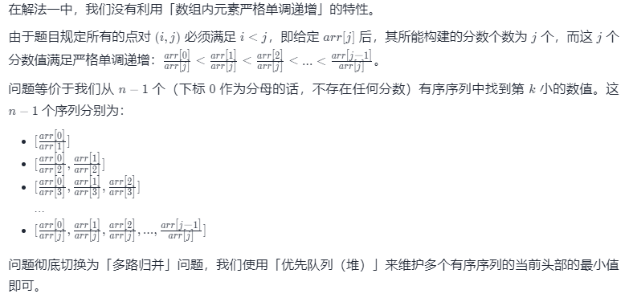
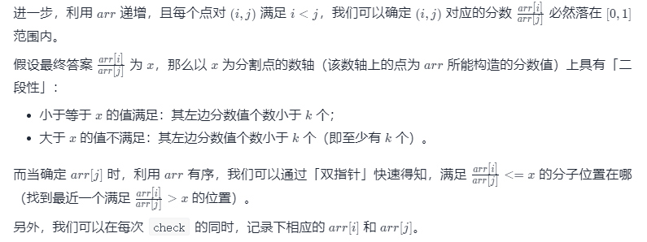
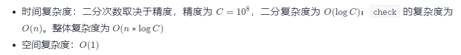

## [第 K 个最小的素数分数](https://leetcode-cn.com/problems/k-th-smallest-prime-fraction/)

给你一个按递增顺序排序的数组 arr 和一个整数 k 。数组 arr 由 1 和若干 素数  组成，且其中所有整数互不相同。

对于每对满足 0 < i < j < arr.length 的 i 和 j ，可以得到分数 arr[i] / arr[j] 。

那么第 k 个最小的分数是多少呢?  以长度为 2 的整数数组返回你的答案, 这里 answer[0] == arr[i] 且 answer[1] == arr[j] 。


示例 1：

**输入**：arr = [1,2,3,5], k = 3
**输出**：[2,5]
**解释**：已构造好的分数,排序后如下所示: 
1/5, 1/3, 2/5, 1/2, 3/5, 2/3
很明显第三个最小的分数是 2/5

示例 2：

**输入**：arr = [1,7], k = 1
**输出**：[1,7]


提示：

- 2 <= arr.length <= 1000
- 1 <= arr[i] <= 3 * 104
- arr[0] == 1
- arr[i] 是一个 **素数** ，i > 0
- arr 中的所有数字 **互不相同** ，且按 **严格递增** 排序
- 1 <= k <= arr.length * (arr.length - 1) / 2

### 优先队列（堆）

数据范围只有 10^3，直接扫描所有点对的计算量不超过 10^6。

因此我们可以使用「扫描点对」+「优先队列（堆）」的做法，使用二元组 (arr[i], arr[j])进行存储，构建大小为 k的大根堆。

根据「堆内元素多少」和「当前计算值与堆顶元素的大小关系」决定入堆行为：

- 若堆内元素不足 k 个，直接将当前二元组进行入堆；
- 若堆内元素已达k 个，根据「当前计算值 arr[i] / arr[j] 与堆顶元素peek[0] / peek[1]的大小关系」进行分情况讨论：
  - 如果当前计算值比堆顶元素大，那么当前元素不可能是第 k 小的值，直接丢弃；
  - 如果当前计算值比堆顶元素小，那么堆顶元素不可能是第 k 小的值，使用当前计算值置换掉堆顶元素。

```java
/** 
    素数定义：除了能被1和它本身整除而不能被其他任何数整除的数。
    float：单精度类型,精度是8位有效数字，取值范围是10的-38次方到10的38次方，float占用4个字节的存储空间
    double：双精度类型，精度是17位有效数字，取值范围是10的-308次方到10的308次方，double占用8个字节的存储空间
*/ 
class Solution {
    public int[] kthSmallestPrimeFraction(int[] arr, int k) {
        int n = arr.length;
        // Double.compare(d1, d2)：如果d1在数字上大于d2，则返回大于0的值
        PriorityQueue<int[]> q = new PriorityQueue<>((a, b) -> Double.compare(b[0] * 1.0 / b[1], a[0] * 1.0 / a[1]));
        for (int i = 0; i < n; i++) {
            for (int j = i + 1; j < n; j++) {
                double t = arr[i] * 1.0 / arr[j];
                if (q.size() < k || q.peek()[0] * 1.0 / q.peek()[1] > t) {
                    if (q.size() == k) {
                        q.poll();
                    }
                    q.add(new int[]{arr[i], arr[j]});
                }
            }
        }
        return q.poll();
    }
}
```

- 时间复杂度：扫描所有的点对复杂度为 O(n^2)；将二元组入堆和出堆的复杂度为 O(logk)。整体复杂度为 O(n^2 * logk)
- 空间复杂度：O(k)

### 多路归并



```java
class Solution {
    public int[] kthSmallestPrimeFraction(int[] arr, int k) {
        int n = arr.length;
        PriorityQueue<int[]> q = new PriorityQueue<>((a, b) -> {
            double i1 = arr[a[0]] * 1.0 / arr[a[1]], i2 = arr[b[0]] * 1.0 / arr[b[1]];
            return Double.compare(i1, i2);
        });
        for (int i = 1; i < n; i++) {
            q.add(new int[]{0, i});
        }
        while (k-- > 1) {
            int[] poll = q.poll();
            int i = poll[0], j = poll[1];
            if (i + 1 < j) {
                q.add(new int[]{i + 1, j});
            }
        }
        int[] poll = q.poll();
        return new int[]{arr[poll[0]], arr[poll[1]]};
    }
}
```


### 二分 + 双指针



```java
class Solution {
    double eps = 1e-8;
    int[] arr;
    int n, a, b;
    public int[] kthSmallestPrimeFraction(int[] _arr, int k) {
        arr = _arr;
        n = arr.length;
        double l = 0, r = 1;
        while (r - l > eps) {
            double mid = (l + r) / 2;
            if (check(mid) >= k) {
                r = mid;
            }
            else {
                l = mid;
            }
        }
        return new int[]{a, b};
    }
    int check(double x) {
        int ans = 0;
        for (int i = 0, j = 1; j < n; j++) {
            while (arr[i + 1] * 1.0 / arr[j] <= x) {
                i++;
            }
            if (arr[i] * 1.0 / arr[j] <= x) {
                ans += i + 1;
            }
            if (Math.abs(arr[i] * 1.0 / arr[j] - x) < eps) {
                a = arr[i]; b = arr[j];
            }
        }
        return ans;
    }
}
```



