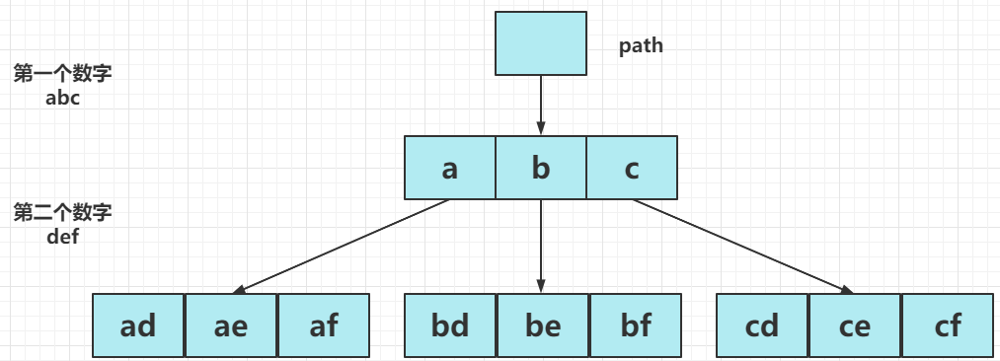
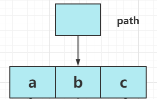

## [电话号码的字母组合](https://leetcode-cn.com/problems/letter-combinations-of-a-phone-number/)

给定一个仅包含数字 2-9 的字符串，返回所有它能表示的字母组合。答案可以按 任意顺序 返回。

给出数字到字母的映射如下（与电话按键相同）。注意 1 不对应任何字母。


> 示例 1：
>
> 输入：digits = "23"
> 输出：["ad","ae","af","bd","be","bf","cd","ce","cf"]
> 示例 2：
>
> 输入：digits = ""
> 输出：[]
> 示例 3：
>
> 输入：digits = "2"
> 输出：["a","b","c"]
>
>
> 提示：
>
> 0 <= digits.length <= 4
> digits[i] 是范围 ['2', '9'] 的一个数字。

### 题解

#### 解题思路

以示例一举例，输入`digits = "23"`，要找到它的输出，只需要通过两个for循环就能完成，每个for循环遍历数字字符对应的字符串。

```java
for (2对应的字母[a, b, c]) {
	for (3对应的字母[d, e, f]) {
	}
}
```



如果 digits 为 k 个数字组成的字符串，同理只需要 k 次for循环即可完成遍历。

```java
// K层for循环
for (2对应的字母[a, b, c]) {
    for (3对应的字母[d, e, f]) {
            ... // 很多层for循环
            for (digit 对应的字母[a, b, c]) {
            }
        }
    }
}
```

所以可以用递归来找到字母的组合，因为**递归就是当多重循环层数不确定的时候, 一个更优雅的实现多重循环的方式**。

因为for循环的条件里，需要找到字符数字对应的字符串，可以定义字符串数组实现映射：

```java
static String[] ss = new String[]{"", "", "abc", "def", "ghi", "jkl", "mno", "pqrs", "tuv", "wxyz"};
```

#### 递归函数设计

- 递归函数定义

```java
private void dfs(String digits, int index, String path)
```

digits：表示输入的字符串（数字），如，`digits = '23'`；

index：表示遍历digits字符串的起始位置；

path：用来装一条路径下的结果，如，ad、ae... 。

- 递归出口

当遍历完digits最后一个元素的时候，就可以返回结果，即 `index = digits.length()`

```java
if (index == digits.length()) {
    results.add(path);
    return ;
}
```

返回的时候，别忘了把每一种情况`path`放进结果容器`results`里。

- 单层递归逻辑

每一层需要遍历字符串`digits = '23'`每一个数字对应的字符串。

```java
int digit = digits.charAt(index) - '0';
for (int i = 0; i < ss[digit].length(); i++) {
    dfs(digits, index + 1, path + ss[digit].charAt(i));
}
```

因为，已经用字符串数组`ss`做了映射，只需要通过**下标**就能获取到数字对应的字符串。

`digit = digits.charAt(index) - '0';`：获取数字下标；

`index + 1`：在同一层的逻辑中，例如，a 已经被遍历过了，下一个元素要遍历 b，所以下标需要+1。



`path + ss[digit].charAt(i)`：这里采用深拷贝的方式，直接传入一个新的字符串到下一层，所以不需要回溯。只有浅拷贝的时候，才需要回溯。因为浅拷贝的话，多个对象引用的是同一个的内存空间，一个改变全部改变，所以需要回溯。

#### 代码

```java
class Solution {
    
    // 数字与对应的字符串做映射
    static String[] ss = new String[]{"", "", "abc", "def", "ghi", "jkl", "mno", "pqrs", "tuv", "wxyz"};
    // 收集所有组合的结果
    ArrayList<String> results = new ArrayList<>();

    public List<String> letterCombinations(String digits) {
        if (digits == null || digits.length() == 0) {
            return results;
        }
        // path 定义为 ""
        dfs(digits, 0, "");
        return results;
    }
    
	// 递归定义
    // index：遍历digits字符串的下标 path：到目前为止得到的组合
    private void dfs(String digits, int index, String path) {
        // 递归出口
        if (index == digits.length()) {
            results.add(path);
            return ;
        }
        // 单层递归逻辑
        int digit = digits.charAt(index) - '0';
        // 遍历下标index位置的数字表示的不同的字母
        for (int i = 0; i < ss[digit].length(); i++) {
            dfs(digits, index + 1, path + ss[digit].charAt(i));
        }
    }
}
```

